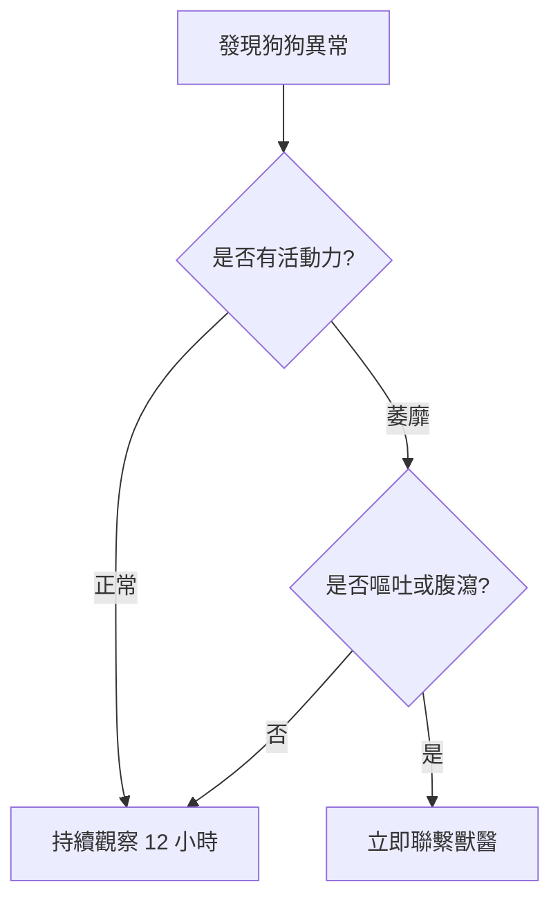

# 🐾 Dog Care SOP

歡迎來到狗狗照顧手冊！希望可以幫忙第一次養狗狗的朋友快速上手！

---

### 📝 Checklist
在接狗狗回家前，請確認以下物品有沒有準備好了：
- [ ] **飲食：** 幼犬/成犬飼料、不鏽鋼或是陶瓷的飯碗和飲水盆。
- [ ] **睡眠：** 舒適的睡墊，沒安全感的狗狗可以先使用圍欄建立安全感。
- [ ] **衛生：** 寵物尿墊、撿便袋、專用洗毛精。
- [ ] **醫療：** 附近24HR獸醫診所的電話和地址。

---

### 🕒 Daily Routine
標準的狗狗生活時程表：

```mermaid
gantt
    title 狗狗每日 SOP
    dateFormat  HH:mm
    axisFormat  %H:%M
    section 晨間
    餵食與換水       :a1, 07:00, 30m
    早晨散步         :a2, 07:30, 45m
    section 午間
    休息與自由活動   :b1, 09:00, 8h
    section 晚間
    晚餐             :c1, 18:00, 30m
    晚間散步與上廁所   :c2, 19:00, 60m
    梳毛和玩遊戲       :c3, 21:00, 30m
```

