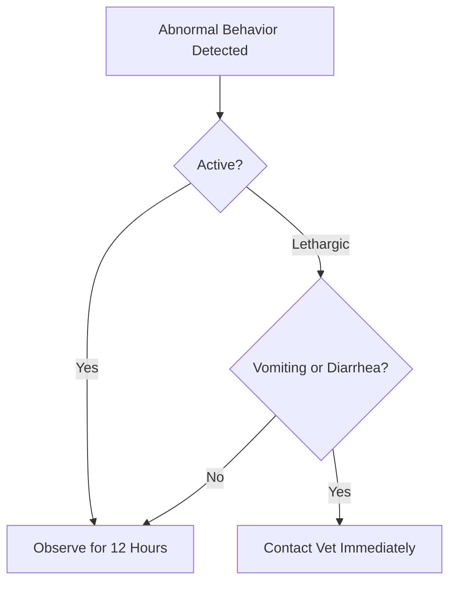

<h1 style="color: #5d688a; font-size: 2.5em; font-weight: bold; margin-bottom: 0;">🐾 Dog Care SOP</h1>

made by Poppy H.

Welcome to the Dog Care Guide! I hope this helps first-time dog owners get started quickly. Wishing you and your dog a wonderful time together!

<h2 style="color: #7a5a58; font-size: 1.8em;">📋 Checklist</h2>

In preparation for bringing your dog home, please ensure the following items are ready:

* **Diet:** Puppy/Adult food, stainless steel or ceramic bowls for food and water. **Please avoid roller-ball water bottles (ball-point bottles)**; they are unsuitable for dogs and prevent them from drinking sufficient water.
* **Sleep:** A comfortable pet bed or a breathable pet cot. For dogs lacking a sense of security, a playpen can help establish a safe space. Covered dog houses are also recommended to reduce anxiety.
* **Hygiene:** Pet pee pads, poop bags, dog-specific shampoo, nail clippers, and grooming scissors or electric clippers. However, if you are inexperienced or the dog is still adjusting to you, it is highly recommended to visit a professional groomer for nail trimming and haircutting.
* **Medical:** Phone number and address of the nearest 24HR veterinary clinic, and a sturdy pet carrier or crate.

```mermaid
gantt
    title Daily Dog Care SOP
    dateFormat  HH:mm
    axisFormat  %H:%M
    section Morning
    Feeding & Water       :a1, 07:00, 30m
    Morning Walk          :a2, 07:30, 45m
    section Daytime
    Rest & Free Time      :b1, 09:00, 8h
    section Evening
    Dinner                :c1, 18:00, 30m
    Evening Walk          :c2, 19:00, 60m
    Brushing & Interaction:c3, 21:00, 30m
```

<h2 style="color: #7a5a58; font-size: 1.8em;">🕒 Daily Routine</h2>

